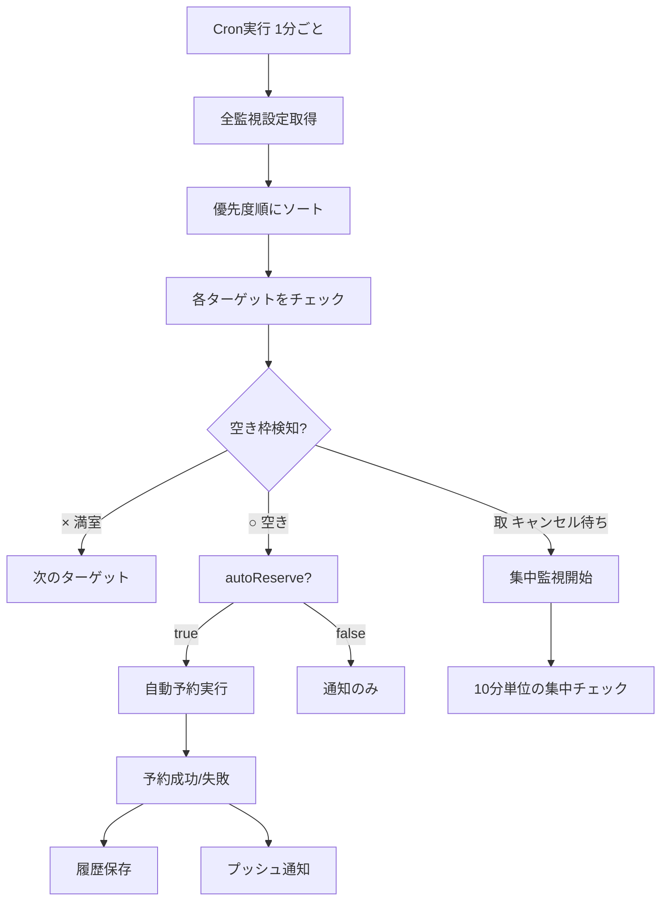

# 🎾 テニスコート自動予約システム - システム仕様書

**バージョン**: v1.1  
**最終更新日**: 2025年12月1日  
**ステータス**: 本番稼働中

---

## 📌 システム概要

### 目的
品川区・港区のテニスコート予約サイトを自動監視し、空き枠を検知して自動予約を行うPWA（Progressive Web App）システムです。

### 主な特徴
- ⚡ **自動監視**: 1分間隔で空き状況を監視
- 🎯 **集中監視**: 品川区の「取」マーク検知時に1秒間隔で監視
- 🤖 **自動予約**: 空き検知時に即座に予約実行
- 📱 **PWA対応**: スマートフォンアプリのように使用可能
- 🔔 **プッシュ通知**: 空き検知・予約成功時に通知
- 🔐 **セキュア**: JWT認証、パスワード暗号化

### 💰 料金体系
- **Cloudflare Workers**: **有料プラン $5/月** (必須)
  - KV書き込み: 無制限
  - サブリクエスト: 1,000/実行
  - CPU時間: 30秒/実行
- **Vercel**: 無料プラン (PWAホスティング)

---

## 🏗️ システムアーキテクチャ

### 全体構成図

```
┌─────────────────────────────────────────────────────────────┐
│                     エンドユーザー                            │
│              (スマートフォン/PC/タブレット)                    │
└────────────────────┬────────────────────────────────────────┘
                     │ HTTPS
                     ↓
┌─────────────────────────────────────────────────────────────┐
│                  PWAアプリ (Vercel)                           │
│  ┌─────────────────────────────────────────────────────┐    │
│  │  Next.js 15 + TypeScript + Tailwind CSS            │    │
│  │  - ダッシュボード (監視状況表示)                      │    │
│  │  - 監視設定 (期間・時間帯・施設選択)                  │    │
│  │  - 予約履歴 (成功/失敗履歴)                          │    │
│  │  - 設定画面 (認証情報管理)                           │    │
│  └─────────────────────────────────────────────────────┘    │
└────────────────────┬────────────────────────────────────────┘
                     │ REST API (JWT認証)
                     ↓
┌─────────────────────────────────────────────────────────────┐
│          Cloudflare Workers (バックエンドAPI)                 │
│                    有料プラン $5/月                            │
│  ┌─────────────────────────────────────────────────────┐    │
│  │  Workers Runtime                                    │    │
│  │  - REST APIエンドポイント                            │    │
│  │  - JWT認証・認可                                     │    │
│  │  - Cronジョブ (1分間隔)                              │    │
│  │  - スクレイピング処理                                 │    │
│  │  - 自動予約処理                                      │    │
│  └─────────────────────────────────────────────────────┘    │
│                                                               │
│  ┌─────────────────────────────────────────────────────┐    │
│  │  KV Storage (データ永続化)                           │    │
│  │  - USERS: ユーザー情報・設定                          │    │
│  │  - SESSIONS: ログインセッション                       │    │
│  │  - MONITORING: 監視設定                              │    │
│  │  - RESERVATIONS: 予約履歴                            │    │
│  └─────────────────────────────────────────────────────┘    │
└────────────────────┬────────────────────────────────────────┘
                     │ HTTP(S) スクレイピング
                     ↓
┌─────────────────────────────────────────────────────────────┐
│                   自治体予約サイト                            │
│  ┌──────────────────────┐  ┌──────────────────────┐        │
│  │  品川区予約システム   │  │  港区予約システム     │        │
│  │  (cm9.eprs.jp)       │  │  (web101.rsv.ws-scs) │        │
│  └──────────────────────┘  └──────────────────────┘        │
└─────────────────────────────────────────────────────────────┘
```

### 技術スタック

#### フロントエンド
| 技術 | バージョン | 用途 |
|------|-----------|------|
| Next.js | 16.0.3 | Reactフレームワーク (App Router) |
| React | 19.2.0 | UIライブラリ |
| TypeScript | 5.x | 型安全な開発 |
| Tailwind CSS | 4.x | スタイリング |
| Zustand | 5.0.8 | 状態管理 (認証状態) |
| Axios | 1.13.2 | HTTPクライアント |
| React Calendar | 6.0.0 | カレンダーUI |
| date-fns | 4.1.0 | 日付操作 |

#### バックエンド
| 技術 | バージョン | 用途 |
|------|-----------|------|
| Cloudflare Workers | - | サーバーレス実行環境 |
| Workers KV | - | NoSQLデータストア |
| Web Crypto API | - | JWT署名・パスワード暗号化 |
| Wrangler | 3.94.0 | 開発・デプロイツール |

#### デプロイ・ホスティング
| サービス | 用途 | 料金 |
|---------|------|------|
| Vercel | PWAホスティング | 無料 |
| Cloudflare Workers | バックエンドAPI | $5/月 (有料プラン) |
| Cloudflare KV | データストレージ | $5/月に含まれる |

---

## 🎯 主要機能

### 1. ユーザー認証・認可

#### 認証方式
- **JWT (JSON Web Token)** ベースの認証
- トークン有効期限: 7日間
- 署名アルゴリズム: HS256

#### ユーザーロール
| ロール | 権限 |
|--------|------|
| **user** | 自分の監視設定・履歴の管理 |
| **admin** | 全ユーザーの管理、システム統計閲覧 |

#### パスワードセキュリティ
- bcrypt相当の強度でハッシュ化
- 自治体サイトのパスワードはAES暗号化して保存
- 暗号化キー: 環境変数で管理

### 2. 監視設定 (MonitoringTarget)

#### 📅 日付モード
```typescript
dateMode: 'single' | 'range' | 'continuous'
```

| モード | 説明 | 使用例 |
|--------|------|--------|
| **single** | 特定の1日のみ監視 | 12月15日だけチェック |
| **range** | 開始日〜終了日の範囲を監視 | 12月1日〜12月31日をチェック |
| **continuous** | 明日から予約可能期間の最後まで自動監視 | システムが自動的に範囲を更新 |

#### 🕐 時間帯設定
```typescript
timeSlots: string[]  // 複数指定可能
```

**例**:
```json
{
  "timeSlots": ["09:00-11:00", "11:00-13:00", "15:00-17:00"]
}
```

#### 📆 曜日フィルタ
```typescript
selectedWeekdays?: number[]  // 0=日, 1=月, ..., 6=土
```

**例**:
```json
{
  "selectedWeekdays": [0, 6]  // 日曜・土曜のみ監視
}
```

#### 🎌 祝日の扱い
```typescript
includeHolidays?: boolean | 'only'
```

| 値 | 動作 |
|----|------|
| `true` | 祝日も含めて監視 (デフォルト) |
| `false` | 祝日を除外して監視 |
| `'only'` | 祝日のみ監視 |

#### ⭐ 優先度
```typescript
priority?: number  // 1-5 (5が最優先、デフォルト: 3)
```

複数の空き枠が同時に見つかった場合、優先度の高い順に予約を実行します。

#### 👥 利用人数
```typescript
applicantCount?: number
```

| 自治体 | デフォルト値 | 範囲 |
|--------|------------|------|
| 品川区 | 2人 | 1-10人 |
| 港区 | 4人 | 1-10人 |

#### 🤖 自動予約設定
```typescript
autoReserve: boolean
```

- `true`: 空き検知時に自動的に予約実行
- `false`: 通知のみ (手動予約が必要)

### 3. 監視・予約フロー

#### 通常監視 (1分間隔)



#### 集中監視モード (品川区のみ)

品川区では「取」マーク = キャンセル待ち状態が存在します。

**トリガー条件**:
- 通常監視で「取」マークを検知

**動作**:
1. **10分単位のタイミング** (10:10, 10:20, 10:30...)
2. その **前後15秒間** を **1秒間隔** でチェック
3. 例: 10:10の場合、09:55〜10:25を1秒間隔で監視

**終了条件**:
- ✅ 予約成功
- ✅ 「取」マーク消失 (他の人が予約)
- ✅ 予約時刻到達 (過去の日時)

**リソース削減効果**:
- 従来: 10分間連続監視 (600回チェック)
- 最適化後: 30秒間のみ監視 (30回チェック)
- **95%のリソース削減**

#### 5:00一斉処理 (深夜待機枠の自動予約)

毎日5:00に実行される特別な処理:

```
1. 全アクティブな監視設定を取得
2. 優先度順にソート
3. 各ターゲットの空き状況を一斉チェック
4. 空きがあれば自動予約実行
```

**目的**: 深夜0:00〜5:00の間に発生した空き枠を確実に取得

### 4. スクレイピング処理

#### 品川区サイト

**ベースURL**: `https://www.cm9.eprs.jp/shinagawa/web`

**ログイン手順**:
```typescript
1. GET /rsvWTransUserLoginAction.do
   → JSESSIONID取得
   
2. POST /rsvWUserAttestationLoginAction.do
   body: {
     'rsvWTransUserLoginForm.usrId': userId,
     'rsvWTransUserLoginForm.usrPswd': password
   }
   → セッション確立
```

**空き状況チェック**:
```typescript
GET /rsvWOpeInstSrchVacantAction.do?
  rsvWOpeInstSrchVacantForm.instCd={facilityId}&
  rsvWOpeInstSrchVacantForm.srchDate={date}
```

**ステータス判定**:
| 画像 | alt属性 | ステータス | 意味 |
|------|---------|-----------|------|
| calendar_available | "空き" | ○ | 予約可能 |
| calendar_delete | "取消処理中" | 取 | キャンセル待ち |
| calendar_full | "予約あり" | × | 満室 |
| calendar_few-available | "一部空き" | △ | 一部空き |

**予約実行手順**:
```typescript
1. GET /rsvWOpeReservedApplyAction.do
   → 予約画面表示

2. POST /rsvWInstUseruleRsvApplyAction.do
   body: { ruleFg: '1' }  // 利用規約に同意

3. POST /rsvWOpeReservedConfirmAction.do
   body: {
     instNo, dateNo, timeNo,
     usrNum: applicantCount,  // 利用人数
     eventName: ''
   }

4. POST /rsvWOpeReservedCompleteAction.do
   → 予約確定
```

#### 港区サイト

**ベースURL**: `https://web101.rsv.ws-scs.jp/web`

**ログイン手順**:
```typescript
1. POST /rsvWUserAttestationLoginAction.do
   body: {
     userId: username,
     password: password
   }
   → JSESSIONID取得
```

**空き状況チェック**:
```typescript
GET /rsvWOpeInstSrchVacantAction.do?
  rsvWOpeInstSrchVacantForm.instCd={facilityId}&
  rsvWOpeInstSrchVacantForm.srchDate={date}
```

**ステータス判定**:
| 表示 | ステータス | 意味 |
|------|-----------|------|
| ○ | ○ | 予約可能 |
| × | × | 満室 |

**注意**: 港区は「取」マーク (キャンセル待ち) が存在しません。

### 5. 予約可能期間の自動検出

システムは以下の優先順位で予約可能期間を判定します:

```typescript
1. HTML自動抽出 (最優先)
   - ヘルプページから「○ヶ月先まで」を検出
   - カレンダーUIのmax-date属性を解析
   → KVに24時間キャッシュ

2. KVキャッシュ利用 (セカンダリ)
   - 24時間以内に取得した期間情報を再利用
   - サブリクエスト削減

3. デフォルト値 (フォールバック)
   - 品川区: 30日
   - 港区: 60日
```

**KVキャッシュキー**:
- `reservation_period:shinagawa`
- `reservation_period:minato`

**データ構造**:
```typescript
interface ReservationPeriodInfo {
  maxDaysAhead: number;  // 予約可能日数
  source: 'html_extraction' | 'kv_cache' | 'fallback';
  detectedAt: number;    // 検出時刻 (タイムスタンプ)
  expiresAt: number;     // キャッシュ有効期限
}
```

### 6. セッション管理

#### セッションライフサイクル

```typescript
interface SessionData {
  sessionId: string;      // JSESSIONID
  site: 'shinagawa' | 'minato';
  loginTime: number;      // ログイン時刻
  lastUsed: number;       // 最終使用時刻
  isValid: boolean;       // 有効フラグ
  userId: string;         // ユーザーID
}
```

**保存場所**:
1. **KV Storage**: 24時間保存
   - Key: `session:{userId}:{site}`
2. **メモリキャッシュ**: 5分間保存
   - 再利用によるKV読み取り削減

**セッションリセット**:
- 深夜3:15に全セッション自動削除 (品川区の制約)

#### 品川区の時間制限

品川区のシステムには深夜時間帯の制約があります:

| 時間帯 | ログイン | 予約 | 備考 |
|--------|---------|------|------|
| 00:00-03:15 | ❌ | ✅ | 既存セッションのみ予約可 |
| 03:15-05:00 | ❌ | ❌ | 完全停止 |
| 05:00-24:00 | ✅ | ✅ | 通常運用 |

**03:15の処理**:
```typescript
// 全ユーザーのセッションを削除
await resetAllSessions(env);
```

---

## 📊 データモデル

### 1. User (ユーザー)

**保存場所**: `USERS` KV Namespace

**キー構造**:
- `user:{email}` → ユーザー情報
- `user:id:{userId}` → メールアドレス (逆引き)

```typescript
interface User {
  id: string;              // UUID
  email: string;           // メールアドレス (ログインID)
  password: string;        // bcryptハッシュ
  role: 'user' | 'admin';  // ロール
  createdAt: number;       // 作成日時 (timestamp)
  updatedAt?: number;      // 更新日時
}
```

### 2. UserSettings (ユーザー設定)

**保存場所**: `USERS` KV Namespace

**キー**: `settings:{userId}`

```typescript
interface UserSettings {
  shinagawa?: {
    username: string;        // 品川区ログインID
    password: string;        // AES暗号化されたパスワード
    sessionId?: string;      // 保存されたセッションID (オプション)
    lastUpdated?: number;
    expiresAt?: number;
  };
  minato?: {
    username: string;        // 港区ログインID
    password: string;        // AES暗号化されたパスワード
    sessionId?: string;      // 保存されたセッションID (オプション)
    lastUpdated?: number;
    expiresAt?: number;
  };
  reservationLimits?: {
    perWeek?: number;        // 週あたりの予約上限
    perMonth?: number;       // 月あたりの予約上限
  };
}
```

### 3. MonitoringTarget (監視設定)

**保存場所**: `MONITORING` KV Namespace

**新形式** (v2.0以降):
- **キー**: `MONITORING:{userId}`
- **値**: `UserMonitoringState` (配列管理)

```typescript
interface UserMonitoringState {
  targets: MonitoringTarget[];  // ユーザーの全監視設定
  updatedAt: number;            // 最終更新時刻
  version: number;              // データバージョン
}

interface MonitoringTarget {
  // 基本情報
  id: string;                   // UUID
  userId: string;               // ユーザーID
  site: 'shinagawa' | 'minato'; // 自治体
  facilityId: string;           // 施設ID (例: "1010100201")
  facilityName: string;         // 施設名
  
  // 日付設定
  date: string;                 // 単一日付 (後方互換性)
  dateMode?: 'single' | 'range' | 'continuous';
  startDate?: string;           // 期間開始日 (YYYY-MM-DD)
  endDate?: string;             // 期間終了日
  
  // 時間帯設定
  timeSlot: string;             // 単一時間帯 (後方互換性)
  timeSlots?: string[];         // 複数時間帯 (例: ["09:00-11:00", "15:00-17:00"])
  
  // フィルタ設定
  selectedWeekdays?: number[];  // 監視曜日 (0=日, 1=月, ..., 6=土)
  includeHolidays?: boolean | 'only';  // 祝日の扱い
  
  // 優先度・自動予約
  priority?: number;            // 1-5 (デフォルト: 3)
  autoReserve: boolean;         // 自動予約フラグ
  reservationStrategy?: 'all' | 'priority_first';
  applicantCount?: number;      // 利用人数
  
  // ステータス
  status: 'active' | 'pending' | 'completed' | 'failed' | 'detected' | 'paused';
  lastCheck?: number;           // 最終チェック時刻
  lastStatus?: '×' | '○' | '取';  // 最後に確認したステータス
  detectedStatus?: '×' | '取' | '○';  // 検知したステータス
  
  // 集中監視用
  intensiveMonitoringUntil?: number;     // 集中監視終了時刻 (廃止予定)
  nextIntensiveCheckTime?: number;       // 次の集中監視時刻
  intensiveMonitoringDate?: string;      // 集中監視対象日付
  intensiveMonitoringTimeSlot?: string;  // 集中監視対象時間帯
  
  // タイムスタンプ
  createdAt: number;            // 作成日時
  updatedAt?: number;           // 更新日時
  detectedAt?: number;          // 空き検知時刻
  failedAt?: number;            // 予約失敗時刻
  failureReason?: string;       // 予約失敗理由
}
```

### 4. ReservationHistory (予約履歴)

**保存場所**: `RESERVATIONS` KV Namespace

**キー**: `history:{userId}`

**値**: 配列管理 `ReservationHistory[]`

```typescript
interface ReservationHistory {
  id: string;                   // UUID
  userId: string;               // ユーザーID
  targetId: string;             // 監視設定ID
  site: 'shinagawa' | 'minato'; // 自治体
  facilityId: string;           // 施設ID
  facilityName: string;         // 施設名
  date: string;                 // 予約日 (YYYY-MM-DD)
  timeSlot: string;             // 時間帯
  status: 'success' | 'failed' | 'cancelled';  // ステータス
  message?: string;             // メッセージ (予約番号など)
  createdAt: number;            // 作成日時
}
```

### 5. SessionData (セッション)

**保存場所**: `SESSIONS` KV Namespace

**キー**: `session:{userId}:{site}`

```typescript
interface SessionData {
  sessionId: string;            // JSESSIONID
  site: 'shinagawa' | 'minato'; // 自治体
  loginTime: number;            // ログイン時刻
  lastUsed: number;             // 最終使用時刻
  isValid: boolean;             // 有効フラグ
  userId: string;               // ユーザーID
}
```

**TTL**: 24時間 (KV自動削除)

---

## 🔄 API仕様

### ベースURL

- **本番環境**: `https://tennis-yoyaku-api.kanda02-1203.workers.dev`
- **開発環境**: `http://localhost:8787`

### 認証

**方式**: Bearer Token (JWT)

**ヘッダー**:
```http
Authorization: Bearer <JWT_TOKEN>
```

### エンドポイント一覧

#### 認証API

##### POST /api/auth/register
ユーザー登録

**リクエスト**:
```json
{
  "email": "user@example.com",
  "password": "password123",
  "adminKey": "tennis_admin_2025"  // 管理者登録時のみ
}
```

**レスポンス**:
```json
{
  "success": true,
  "data": {
    "user": {
      "id": "uuid",
      "email": "user@example.com",
      "role": "user",
      "createdAt": 1701234567890
    },
    "token": "eyJhbGciOiJIUzI1NiIs..."
  }
}
```

##### POST /api/auth/login
ログイン

**リクエスト**:
```json
{
  "email": "user@example.com",
  "password": "password123"
}
```

**レスポンス**:
```json
{
  "success": true,
  "data": {
    "user": {
      "id": "uuid",
      "email": "user@example.com",
      "role": "user",
      "createdAt": 1701234567890
    },
    "token": "eyJhbGciOiJIUzI1NiIs..."
  }
}
```

#### 監視API

##### GET /api/monitoring/list
監視リスト取得

**レスポンス**:
```json
{
  "success": true,
  "data": [
    {
      "id": "uuid",
      "site": "shinagawa",
      "facilityName": "しながわ区民公園テニスコート",
      "dateMode": "range",
      "startDate": "2025-12-01",
      "endDate": "2025-12-31",
      "timeSlots": ["09:00-11:00", "15:00-17:00"],
      "selectedWeekdays": [0, 6],
      "priority": 5,
      "autoReserve": true,
      "status": "active",
      "createdAt": 1701234567890
    }
  ]
}
```

##### POST /api/monitoring/create
監視設定作成

**リクエスト**:
```json
{
  "site": "shinagawa",
  "facilityId": "1010100201",
  "facilityName": "しながわ区民公園テニスコート",
  "dateMode": "range",
  "startDate": "2025-12-01",
  "endDate": "2025-12-31",
  "timeSlots": ["09:00-11:00", "15:00-17:00"],
  "selectedWeekdays": [0, 6],
  "priority": 5,
  "includeHolidays": true,
  "autoReserve": true,
  "applicantCount": 2
}
```

##### POST /api/monitoring/create-batch
監視設定一括作成

**リクエスト**:
```json
{
  "targets": [
    {
      "site": "shinagawa",
      "facilityId": "1010100201",
      "facilityName": "しながわ区民公園テニスコート",
      "dateMode": "continuous",
      "timeSlots": ["09:00-11:00"],
      "autoReserve": true
    },
    // ... 他の監視設定
  ]
}
```

**レスポンス**:
```json
{
  "success": true,
  "data": {
    "created": 10,
    "total": 12,
    "targets": [ /* ... */ ],
    "errors": [
      {
        "index": 5,
        "facilityName": "大井ふ頭中央海浜公園",
        "error": "duplicate - already exists"
      }
    ]
  }
}
```

##### DELETE /api/monitoring/:id
監視設定削除

##### PATCH /api/monitoring/:id
監視設定更新

**リクエスト**:
```json
{
  "status": "paused",
  "timeSlots": ["09:00-11:00", "11:00-13:00"],
  "selectedWeekdays": [1, 2, 3, 4, 5],
  "includeHolidays": false
}
```

#### 設定API

##### GET /api/settings
ユーザー設定取得

**レスポンス**:
```json
{
  "success": true,
  "data": {
    "shinagawa": {
      "username": "12345678",
      "password": "encrypted:..."
    },
    "minato": {
      "username": "user@example.com",
      "password": "encrypted:..."
    },
    "reservationLimits": {
      "perWeek": 5,
      "perMonth": 20
    }
  }
}
```

##### POST /api/settings
ユーザー設定保存

**リクエスト**:
```json
{
  "shinagawa": {
    "username": "12345678",
    "password": "mypassword"
  },
  "minato": {
    "username": "user@example.com",
    "password": "mypassword"
  },
  "reservationLimits": {
    "perWeek": 5,
    "perMonth": 20
  }
}
```

#### 履歴API

##### GET /api/reservations/history
予約履歴取得

**パラメータ**:
- `limit`: 取得件数 (デフォルト: 50)

**レスポンス**:
```json
{
  "success": true,
  "data": [
    {
      "id": "uuid",
      "site": "shinagawa",
      "facilityName": "しながわ区民公園テニスコート",
      "date": "2025-12-15",
      "timeSlot": "09:00-11:00",
      "status": "success",
      "message": "予約に成功しました (予約番号: 12345)",
      "createdAt": 1701234567890
    }
  ]
}
```

#### 施設API

##### GET /api/facilities/shinagawa
品川区施設一覧取得

##### GET /api/facilities/minato
港区施設一覧取得

**レスポンス**:
```json
{
  "success": true,
  "data": [
    {
      "facilityId": "1010100201",
      "facilityName": "しながわ区民公園テニスコート",
      "category": "テニスコート",
      "isTennisCourt": true
    }
  ]
}
```

#### その他API

##### GET /api/reservation-period?site={site}
予約可能期間取得

**レスポンス**:
```json
{
  "success": true,
  "data": {
    "maxDaysAhead": 30,
    "source": "html_extraction",
    "detectedAt": 1701234567890,
    "expiresAt": 1701320967890
  }
}
```

##### GET /api/health
ヘルスチェック

##### GET /api/metrics/kv
KVメトリクス取得

---

## 🔧 最適化・パフォーマンス

### KV最適化 (Phase 1.5)

#### 配列管理への移行

**従来の問題**:
```typescript
// 非効率: list()操作で全件スキャン
const { keys } = await kv.list({ prefix: 'monitoring:target:' });
// 1000件の監視設定 → 1000回のlist() + 1000回のget()
```

**最適化後**:
```typescript
// 効率的: ユーザー単位で配列管理
const state = await kv.get(`MONITORING:${userId}`, 'json');
// 1回のget()で全監視設定を取得
```

**削減効果**:
- KV読み取り: **51%削減**
- KV書き込み: **87%削減**

#### メモリキャッシュ

```typescript
// セッションキャッシュ (5分間)
const sessionCache = new Map<string, SessionCacheEntry>();
const SESSION_CACHE_TTL = 5 * 60 * 1000;

// 監視リストキャッシュ (3分間)
const monitoringListCache: MonitoringListCache = {
  data: null,
  expires: 0
};
const MONITORING_LIST_CACHE_TTL = 3 * 60 * 1000;
```

**効果**:
- KVアクセス削減
- レスポンス速度向上
- Workers CPU時間削減

#### 差分更新

```typescript
// ステータス変更時のみKV書き込み
if (previousStatus !== newStatus) {
  await kv.put(key, JSON.stringify(target));
} else {
  console.log('[Optimized Skip] No change, write skipped');
}
```

### サブリクエスト管理

**有料プラン制限**: 1,000リクエスト/実行

**カウンター**:
```typescript
let subrequestCount = 0;

globalThis.fetch = async (...args) => {
  subrequestCount++;
  return originalFetch(...args);
};
```

**ログ出力**:
```
📊 [Subrequest Metrics]
   Total: 450/1000
   ✅ 有料プラン制限内: 残り550リクエスト
```

### 並列処理

```typescript
// 全ターゲットを並列でチェック
await Promise.all(
  targets.map(target => 
    checkAndNotify(target, env).catch(error => {
      console.error(`Error: ${error}`);
    })
  )
);
```

**メリット**:
- 実行時間の短縮
- 集中監視中も他のターゲットが停止しない
- リソースの効率的な利用

---

## 🔐 セキュリティ対策

### パスワード管理

#### ユーザーパスワード (JWT用)
```typescript
// ハッシュ化 (bcrypt相当)
const hashedPassword = await hashPassword(password);

// 検証
const isValid = await verifyPassword(password, hashedPassword);
```

#### 自治体サイトパスワード
```typescript
// AES暗号化
const encryptedPassword = await encryptPassword(password, ENCRYPTION_KEY);

// 復号化 (使用時のみ)
const decryptedPassword = await decryptPassword(encryptedPassword, ENCRYPTION_KEY);
```

### JWT認証

**署名アルゴリズム**: HS256

**ペイロード**:
```typescript
{
  userId: string;
  email: string;
  role: 'user' | 'admin';
  exp: number;  // 有効期限 (7日間)
}
```

**検証**:
```typescript
const payload = await verifyJWT(token, JWT_SECRET);
if (payload.exp < Date.now()) {
  throw new Error('Token expired');
}
```

### CORS設定

```typescript
const corsHeaders = {
  'Access-Control-Allow-Origin': '*',
  'Access-Control-Allow-Methods': 'GET, POST, PUT, DELETE, OPTIONS',
  'Access-Control-Allow-Headers': 'Content-Type, Authorization',
};
```

---

## 📱 PWA機能

### Service Worker

**ファイル**: `/public/service-worker.js`

**機能**:
- オフライン対応
- プッシュ通知受信
- キャッシュ管理

### Manifest

**ファイル**: `/public/manifest.json`

```json
{
  "name": "テニスコート予約",
  "short_name": "予約",
  "start_url": "/dashboard",
  "display": "standalone",
  "background_color": "#ffffff",
  "theme_color": "#3b82f6",
  "icons": [
    {
      "src": "/icons/icon-192x192.png",
      "sizes": "192x192",
      "type": "image/png"
    },
    {
      "src": "/icons/icon-512x512.png",
      "sizes": "512x512",
      "type": "image/png"
    }
  ]
}
```

### プッシュ通知

**VAPID Keys**: 環境変数で管理

**購読処理**:
```typescript
// フロントエンド
const subscription = await registration.pushManager.subscribe({
  userVisibleOnly: true,
  applicationServerKey: VAPID_PUBLIC_KEY
});

// バックエンドに保存
await apiClient.subscribePush(subscription);
```

**通知送信**:
```typescript
await sendPushNotification(userId, {
  title: "空き枠検知",
  body: "しながわ区民公園テニスコート 12/15 09:00-11:00"
}, env);
```

---

## 🚀 デプロイ手順

### 前提条件

- Node.js 18以上
- npm または yarn
- Cloudflare アカウント (Workers/KV)
- Vercel アカウント (PWA)

### 1. Workers デプロイ

```bash
cd workers
npm install

# Cloudflareにログイン
npx wrangler login

# KV Namespace作成 (初回のみ)
npx wrangler kv:namespace create USERS
npx wrangler kv:namespace create SESSIONS
npx wrangler kv:namespace create MONITORING
npx wrangler kv:namespace create RESERVATIONS

# wrangler.tomlにNamespace IDを設定

# 本番環境デプロイ
npm run deploy

# 開発環境デプロイ
npm run deploy:dev
```

### 2. PWA デプロイ (Vercel)

```bash
cd pwa
npm install

# 環境変数設定 (.env.local)
NEXT_PUBLIC_API_URL=https://tennis-yoyaku-api.kanda02-1203.workers.dev

# ビルド
npm run build

# Vercelデプロイ
npx vercel --prod
```

### 3. 環境変数設定

#### Workers (wrangler.toml)

```toml
[vars]
ENVIRONMENT = "production"
JWT_SECRET = "your-strong-jwt-secret-here"
ADMIN_KEY = "tennis_admin_2025"
VAPID_PUBLIC_KEY = "your-vapid-public-key"
VAPID_PRIVATE_KEY = "your-vapid-private-key"
VAPID_SUBJECT = "mailto:your-email@example.com"

# ENCRYPTION_KEYはwrangler secretで設定
```

**機密情報の設定**:
```bash
# 暗号化キーを生成
node workers/generate-encryption-key.ts

# Secretとして保存
npx wrangler secret put ENCRYPTION_KEY
# → 生成されたキーをペースト
```

#### PWA (Vercel環境変数)

Vercelダッシュボードで設定:
- `NEXT_PUBLIC_API_URL`: Workers APIのURL

---

## 📊 監視・メトリクス

### リアルタイムログ

```bash
# Workersログをリアルタイム表示
npx wrangler tail tennis-yoyaku-api --format pretty

# 特定のキーワードでフィルタ
npx wrangler tail tennis-yoyaku-api --format pretty 2>&1 | grep "検知"
```

### KVメトリクス

```bash
# APIエンドポイントで確認
curl https://tennis-yoyaku-api.kanda02-1203.workers.dev/api/metrics/kv
```

**レスポンス例**:
```json
{
  "reads": 120,
  "writes": 15,
  "cacheHits": 80,
  "cacheMisses": 40,
  "writesSkipped": 95,
  "cacheHitRate": 0.67,
  "writeSkipRate": 0.86,
  "elapsedMinutes": 45.2
}
```

### KVデータ確認

```bash
# ユーザー設定確認
npx wrangler kv:key get "settings:USER_ID" --namespace-id=NAMESPACE_ID

# 監視設定確認
npx wrangler kv:key get "MONITORING:USER_ID" --namespace-id=NAMESPACE_ID

# 予約履歴確認
npx wrangler kv:key get "history:USER_ID" --namespace-id=NAMESPACE_ID
```

---

## 🐛 トラブルシューティング

### よくある問題

#### 1. ログインできない

**症状**: 設定画面で認証情報を保存したが、監視が動作しない

**原因**:
- パスワードが間違っている
- セッションが期限切れ

**対処法**:
```bash
# セッションをクリア
npx wrangler kv:key delete "session:USER_ID:shinagawa" --namespace-id=SESSIONS_ID
npx wrangler kv:key delete "session:USER_ID:minato" --namespace-id=SESSIONS_ID

# 設定画面で認証情報を再入力
```

#### 2. 予約が失敗する

**症状**: 空き枠を検知したが予約に失敗する

**原因**:
- 他の人が先に予約した
- セッションが無効
- 予約可能期間外

**ログ確認**:
```bash
npx wrangler tail tennis-yoyaku-api --format pretty 2>&1 | grep "予約"
```

#### 3. 監視が動作しない

**症状**: Cronが実行されているが監視されない

**確認事項**:
1. 監視設定が`active`状態か
2. 日付範囲が正しいか
3. 曜日フィルタが適切か

**KV確認**:
```bash
npx wrangler kv:key get "MONITORING:USER_ID" --namespace-id=MONITORING_ID | jq
```

#### 4. KV書き込み制限エラー

**症状**: `KV write limit exceeded` エラー

**原因**: KV書き込み回数の上限到達 (有料プランでは無制限のはず)

**対処法**:
1. 有料プランになっているか確認
2. 不要なwrite操作がないか確認
3. メモリキャッシュが機能しているか確認

### デバッグコマンド

```bash
# 全監視設定を確認
npx wrangler kv:key list --prefix="MONITORING:" --namespace-id=MONITORING_ID

# 特定ユーザーの監視設定を確認
npx wrangler kv:key get "MONITORING:USER_ID" --namespace-id=MONITORING_ID | jq '.targets[] | {facilityName, status, dateMode, timeSlots}'

# 予約可能期間キャッシュを確認
npx wrangler kv:key get "reservation_period:shinagawa" --namespace-id=MONITORING_ID
npx wrangler kv:key get "reservation_period:minato" --namespace-id=MONITORING_ID

# キャッシュをクリア
npx wrangler kv:key delete "reservation_period:shinagawa" --namespace-id=MONITORING_ID
npx wrangler kv:key delete "reservation_period:minato" --namespace-id=MONITORING_ID
```

---

## 📝 制限事項・既知の問題

### システム制限

1. **品川区の深夜時間帯制限**
   - 00:00-03:15: ログイン不可
   - 03:15-05:00: 予約不可

2. **予約可能期間**
   - 品川区: 30日先まで
   - 港区: 60日先まで
   - 変更される可能性あり (自動検出で対応)

3. **Cloudflare Workers制限** (有料プラン)
   - サブリクエスト: 1,000/実行
   - CPU時間: 30秒/実行
   - KV書き込み: 無制限

### 既知の問題

1. **施設リストのハードコード**
   - 現在は固定データを使用
   - 将来的に動的取得への移行が必要

2. **セッション管理**
   - 品川区は03:15に強制リセット
   - 港区は24時間でタイムアウト

3. **並行予約の競合**
   - 複数ユーザーが同じ枠を狙う場合、先着順
   - システム側で制御不可

---

## 🔮 今後の改善予定

### Phase 2.0 (計画中)

- [ ] 施設リストの動的取得
- [ ] リアルタイム通知の強化
- [ ] 監視状況の可視化ダッシュボード
- [ ] 予約成功率の分析レポート
- [ ] 監視テンプレート機能
- [ ] モバイルアプリ最適化

### Phase 3.0 (構想)

- [ ] AWS Lambda集中監視 (10秒間隔)
- [ ] 機械学習による予約成功率予測
- [ ] 複数ユーザー間の協調予約
- [ ] LINE通知対応

---

## 📚 関連ドキュメント

- **[README.md](./README.md)** - プロジェクト概要
- **[CLIENT_MANUAL.md](./CLIENT_MANUAL.md)** - クライアント向けマニュアル
- **[SYSTEM_OVERVIEW.md](./SYSTEM_OVERVIEW.md)** - システム概要
- **[RELEASE_NOTES.md](./RELEASE_NOTES.md)** - リリースノート
- **[OPERATIONS_TASKS.md](./OPERATIONS_TASKS.md)** - 運用タスク

---

## 👤 開発者情報

**開発者**: youshi-kanda  
**GitHub**: [@youshi-kanda](https://github.com/youshi-kanda)  
**リポジトリ**: [tennis_yoyaku](https://github.com/youshi-kanda/tennis_yoyaku)

---

## 📄 ライセンス

MIT License

---

**最終更新**: 2025年12月1日  
**バージョン**: v1.1  
**ドキュメント作成者**: GitHub Copilot (Claude Sonnet 4.5)
